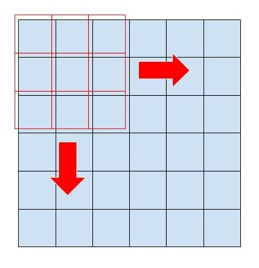
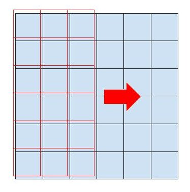

# 9-7 畳み込みニューラルネットワーク
## 参考記事
- https://qiita.com/icoxfog417/items/5fd55fad152231d706c2

## 畳み込みのイメージ
- 2次元畳み込み


- 1次元畳み込み


- 0次元?畳み込み（=全結合層）


## 実装
- docker-composeのruntime用にパスを通す
```
cd /etc/docker
touch daemon.json
```
- `/etc/docker/daomon.json`を編集
```
{
  "default-runtime": "nvidia",
  "runtimes": {
     "nvidia": {
       "path": "/usr/bin/nvidia-container-runtime",
       "runtimeArgs": []
       }
     }
}
```
- Docker再起動
```
sudo systemctl daemon-reload
sudo systemctl restart docker
```
- NVIDIA Dockerでgpu版tensorflowを実行
```
docker-compose build
docker-compose up -d
docker-compose exec tf_gpu /bin/bash
```
- train.pyを実行（前処理済のembeddingベクトルを読み込む）＋コンソールへ表示させながらファイルへ出力
```
/work# python -u train.py -sf -lt 2>&1 | tee hogehoge.log
```

## 学習
- トレーニング速度比較（Epoch平均）

|model|cpu|gpu|
|---|---|---|
|RNN-None|30s|9s|
|LSTM-None|34s|13s|
|CNN-None|12s|5s|
|RNN-wv|14s|10s|
|LSTM-wv|36s|13s|
|CNN-wv|12s|4s|
|CNN-wv-notrain|10s|1s|

